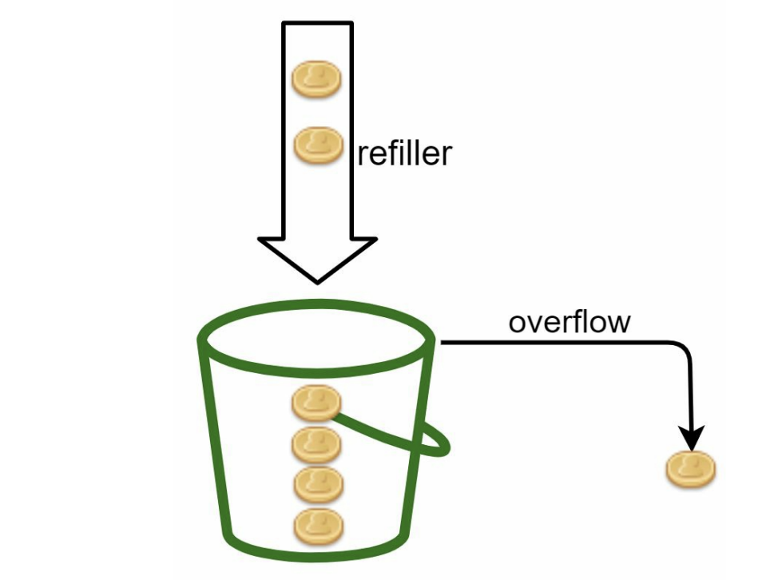
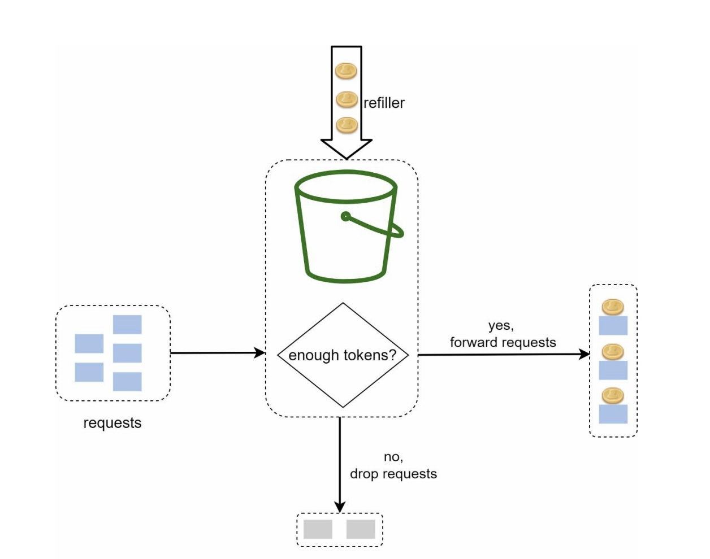
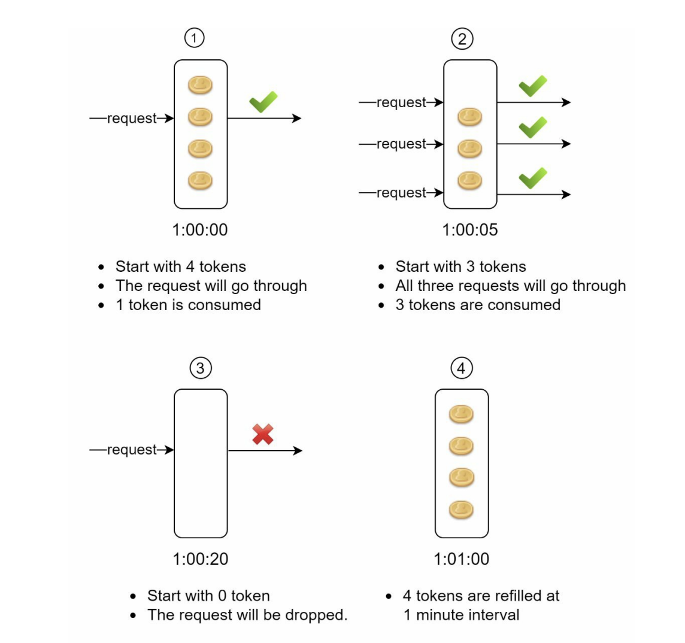

# Token Bucket Rate Limiter

> Used by [Amazon](https://docs.aws.amazon.com/apigateway/latest/developerguide/api-gateway-request-throttling.html) and [Stripe](https://stripe.com/docs/rate-limiters)

---

## How It Works

1. You have a bucket with a certain capacity (e.g. 100 tokens).
2. You have a refiller that adds tokens to the bucket at a certain rate (e.g. 10 tokens per second).
3. Once the bucket is full, it will not accept any more tokens.



4. A request comes to the rate limiter.
5. If there are enough tokens in the bucket, one token is removed for each request and the request is processed.
6. If there are not enough tokens, the request is dropped.



---

## How the Algorithm Works at a Lower Level

The algorithm takes two parameters:

| Parameter | Description | Example |
|-----------|-------------|---------|
| **Bucket Size** | The maximum number of tokens allowed in the bucket | 4 tokens |
| **Refill Rate** | The rate at which tokens are added to the bucket | 4 tokens/min |

**Step-by-step walkthrough:**

| Time | Event | Tokens Remaining |
|------|-------|-----------------|
| `1:00:00` | Bucket starts full. 1 request goes through — 1 token removed. | 3 |
| `1:00:05` | 3 requests go through — all remaining tokens removed. | 0 |
| `1:00:20` | No requests can go through — no tokens available. | 0 |
| `1:01:00` | Refiller replenishes the bucket after 1 minute. | 4 |



---

## How Many Buckets Do We Need?

**1. Per API endpoint** — It is usually necessary to have different buckets for different API endpoints. For instance, a user might be allowed to:

- Make 1 post per second → 1 bucket
- Add 150 friends per day → 1 bucket
- Upload 100 photos per day → 1 bucket

That's **3 buckets** in total.

**2. Per IP address** — If we need to throttle based on IP address, each IP address requires its own bucket.

**3. Global bucket** — If a system allows a maximum of 10,000 requests per second, it is reasonable to have a single global bucket shared by all requests.

---

## Running the Demo

### Prerequisites

```bash
python3 -m venv venv
source venv/bin/activate
pip install fastapi uvicorn
```

### 1. Start the Server

```bash
cd token-bucket-rate-limiter
uvicorn server:app --reload --port 8000
```

The API will be available at `http://localhost:8000`.

### 2. Open the Client

Open `index.html` in your browser:

```bash
open index.html
```

The frontend polls the server every 500ms and displays the bucket state in real-time.